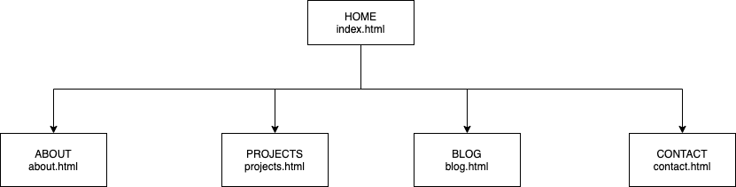
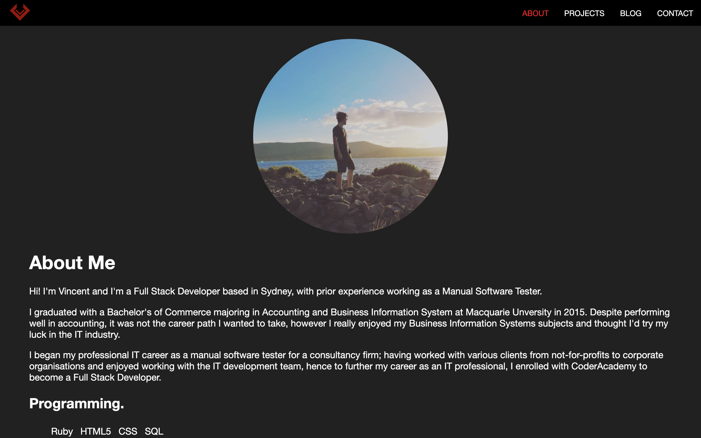
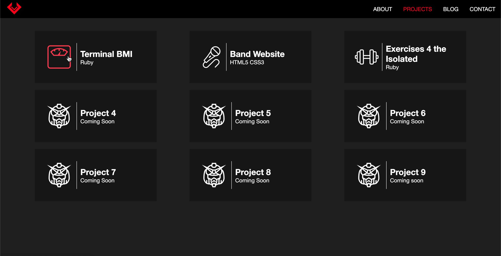
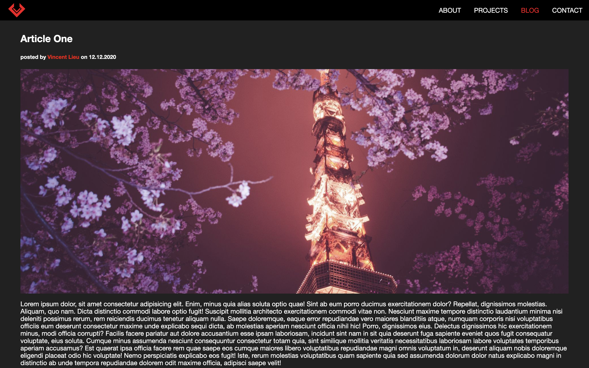
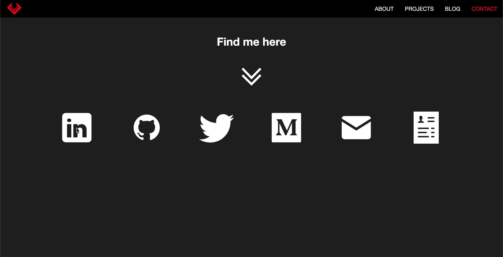
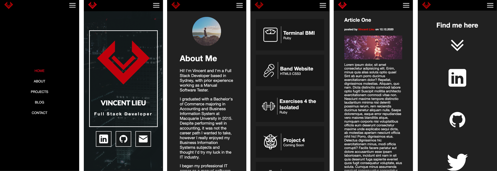
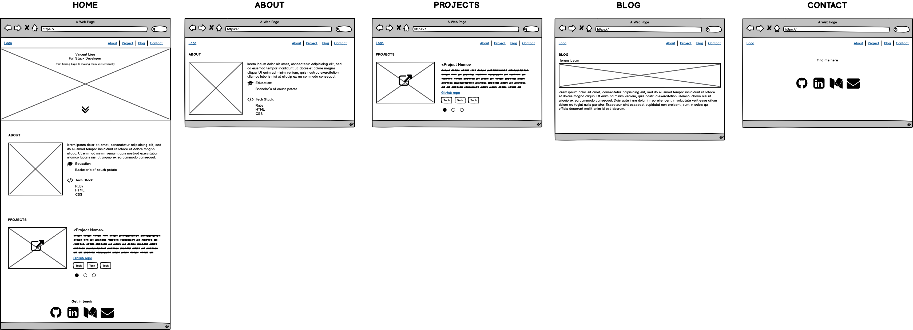
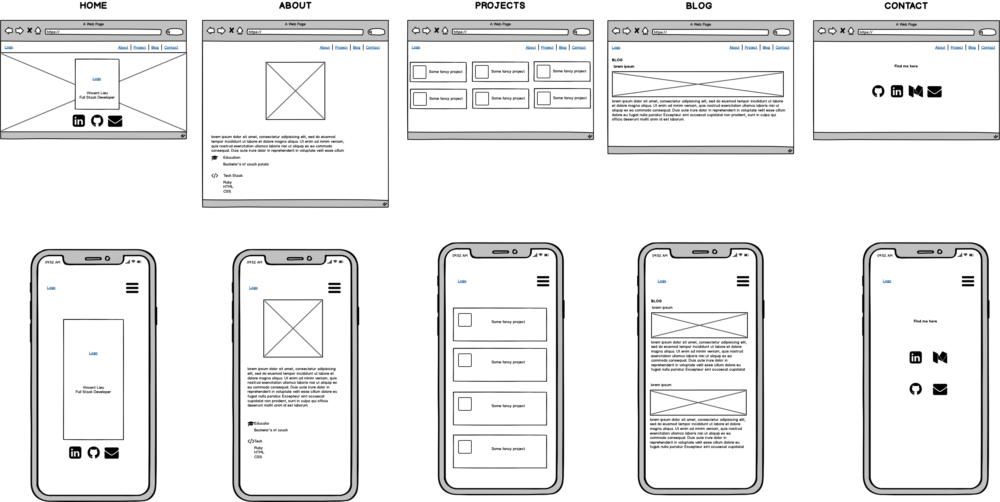

## **Vincent Lieu's Portfolio Website**

---

**Portfolio:** https://vincentlieu.github.io/portfolio/

**Github:** https://github.com/vincentlieu/portfolio/

___

### **Purpose**

The purpose of the portfolio website is to provide visibility of my skills, interests and experience to potential employers. Creating a portfolio to highlight my work will assist in providing opportunities into the information technology industry. As an aspiring developer, the portfolio website exhibits web development and design capabilities. 

### **Functionality/Features**

1. **Navigation**
   A navigation bar is located at the top of the each page to provide accessibility across the content on the portfolio website. The navigation bar provides the user a list of available webpages on the portfolio websit; these links include: Home (hidden on desktop view/ shown on mobile view), About, Projects, Blog and Contact. 
   Depending on the user's current page; the current page will be highlighted in a different color to indicate to the user what page they are currently viewing. Additionality the hover effect (highlight) provided in the navigation bar is to provide an interactive experience for the user and also indicate to the user that the element is interactable (clickable).

   
   
2. **Animation**
   Animations are provided across the porfolio to indiciate to the user that an element is interactable, provide a sense of direction or keeps the user interested. Animations that have been implemented into the portfolio site include colour changes, transformation or breathing. 

   **Breathing effect:** Implemented on the navigation bar logo and main home page to provide a night cityscape vibe like the featured background of the cityscape. The breathing effect was implemented to imitate the signalling lights on top of buildings for aeroplanes. 

   **Colour change effect:** Implemented on the navigation bar, project cards and about skills and locations. The colour change effect was implemented to indicate to the user that the element is interactable. 

   **Transformation effect:** Implemented on the main and contact page. The transformation effect was implemented to draw the user attention to elements that are important and that the element is interactable.

   **Bounce effect:** Implemented on the chevron on the contact page. The bounce effect is to indicate direction to the user that the elements beneath the animation is interactable.

   

3. **External links**
Links are provided throughout the website to direct the user to provide more information that are not explicitly provided on the portfolio. Some external links include access to GitHub or LinkedIn. Providing external links allows the user to dive further into myself as an individual through platforms on LinkedIn, Twitter or Medium; or GitHub projects that I have worked on.

   

4. **Responsive Design**
   Responsive design was implemented through the use of flexbox. By implementing flex; it allows different users to access the portfolio website from different devices comprising of different screen resolutions. The responsive design is implemented to provide better readability of the portfolio's content when accessed from different devices and provides more exposure for users to access the website. Using flexbox allowed the portfolio's content to be wrapped to prevent horizontal scroll; this was achieved by using flex-wrap. Using flex box also allowed content within the div to be distributed evenly, spaced around or space between without having to provide calculations based on screen sizes. 

   

5. **Hamburger Menu**

   Hamburger menu was implemented so that the navigation links does not overflow. Providing a hamburger menu allows a better user experience for those that are accessing the portfolio through their mobile devices. The user is able to toggle the hamburger menu on their mobile device to bring up the navigation links, the user's current active page will still be highlighted within the hamburger menu. In addition a Home navigation link is also provided to provide a better user experience, since not all users would expect to click on the logo to navigate home.

   

6. **Portfolio Variance**
   Three versions of the portfolio have been produced and resides on GitHub. These branches are accessible through the command.

   `git checkout light`

   **Master** - Base version of the website.

   **Light** - Light colour scheme.

   **Font** - Design using the Roboto theme.

   

7. **Subresource Integrity (SRI)**

   This portfolio has subresource integrity, which is a security feature to ensure that its resources have not been manipulated when being fetched by the browser. This was done by using the terminal to generate a sha-512 hash with open ssl within the directory of the resource that requires it. Once the SRI hash has been created; the link tag in the HTML document for the styles.css will need to contain the hash value under the integrity attribute. If there are any changes detected in the CSS file; the HTML file will be loaded without it's styling.

___

### **Target audience**

The target audience for this portfolio are for:

1. Technology recruiters
2. Developers

The portfolio is intended to demostrate my capabilities as a full stack developer. It highlights my personality, work and is complimentary to the traditional method of providing an application to an employer. Those that are visiting my portfolio may consider myself for employment to work on interesting projects.

___

### **Tech Stack**

1. HTML5 
2. CSS3 
3. Javascript 
4. Git - Version Control System
5. GitPages - Hosting

___

### **Sitemap**

___

### **Screenshots**

#### **Home**

#### About

#### Projects

#### Blog

#### Contact

#### Mobile

___

**Wireframes**

**Version 1**

**Version 2 (Final)**

